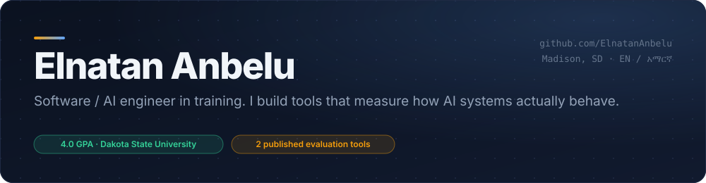
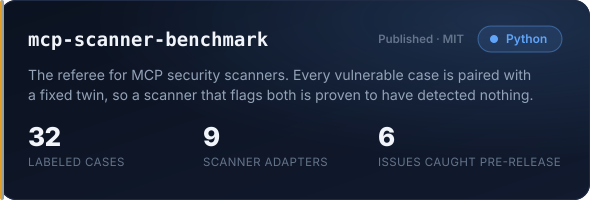
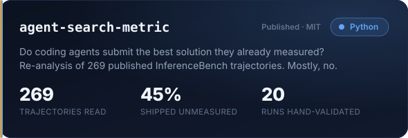
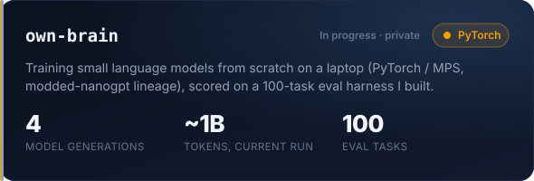
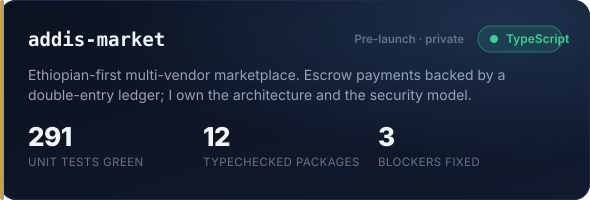

&nbsp;
&nbsp;

Cyber Operations student at Dakota State University, building and publishing tools that measure how AI systems actually behave. Two open-source evaluation tools shipped, a from-scratch LLM training track in progress, and a marketplace platform architected end to end. Looking for **Software Engineer / AI Engineer internships for Summer 2027**.

**[mcp-scanner-benchmark](https://github.com/ElnatanAnbelu/mcp-scanner-benchmark)** — A dozen MCP security scanners shipped last year and nobody had compared them, so I built the referee instead of a thirteenth scanner. Every vulnerable test case is paired with a nearly identical fixed twin: a scanner that flags both has detected nothing, which precision and recall alone will happily hide. I commissioned a hostile review before publishing and it found six things that would have discredited the project, including one claim that was wrong in the direction that flattered my own thesis. All six were fixed before release.

**[agent-search-metric](https://github.com/ElnatanAnbelu/agent-search-metric)** — Re-analyzed 269 published coding-agent trajectories to ask a question the source paper states but never measures: when an agent tries several configurations, does it submit the best one it actually tested? Of 33 runs that had a real choice, 45% submitted a configuration they had never measured at all. I hand-validated 20 runs against raw traces first and found four defects inflating my own headline number — all documented in `VALIDATION.md`, all fixed before publishing.

Also public: **[ethioexam](https://github.com/ElnatanAnbelu/ethioexam)**, an offline practice app for the Ethiopian Grade 9–12 national science exam.

**Own Brain** — Four model generations so far, base pretrain through SFT, on consumer hardware. Currently mid-run on a ~1B-token pretrain. Writeup and repo coming.

**Addis Market** — Next.js, Expo, Supabase. Escrow payments backed by a double-entry ledger, Chapa integration. Code-complete and pre-launch; private for now.

<b>Hands-on</b>  

  <b>Working knowledge, AI-directed delivery</b>  

I architect systems and direct AI to implement them — the design, the security model, and the technical calls are mine; a lot of the feature code is written by agents under instruction. The training runs, the benchmark harnesses, and the analysis above are hands-on. I'd rather tell you which is which than let you find out in an interview.

The habit I'd want you to notice: I try to break my own results before anyone else can. Both published projects shipped with a validation pass that changed the headline.

elnatananbelu@gmail.com · Madison, SD · English / Amharic

